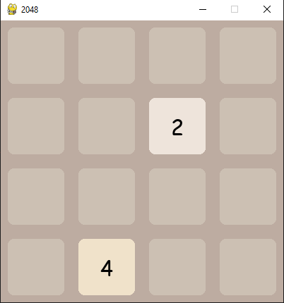
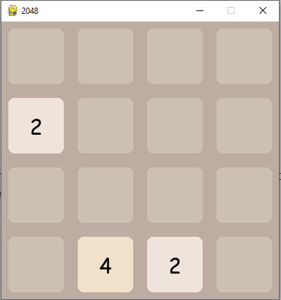
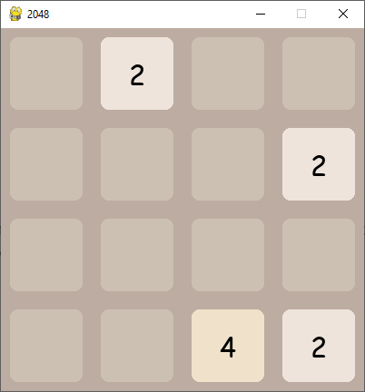
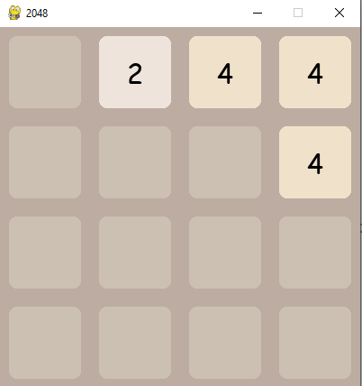
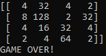

# Game 2048
<h2>Developers</h2>
<i>Was created by <b>Dastan Kadyrov</b> and <b>Altynbek kyzy Zhainagul</b></i>
<h6></h6>
<h2>Instructions fot Game play</h2>

<b>2048</b>, the game that we developed with python language on pygame is a remake of the popular mobile game 2048.

The game can be played in a 4x4 grid by moving and combining valued tiles in order to get a score of 2048.

User will use the arrow keys to move the tiles on the board. When two tiles with the same number touch, if they are next to each other then they will merge into one with a value of the two tiles!

After each turn, a new tile will spawn randomly.

<b><i>For example:</i></b>

If two tiles with a value 2 are moved and are next to each other then they will merge into one tile with a value 4. If with a value 4 then the result will be 8 and etc.

The minimum value, integer in this game is 2. And all values of the game 2048 are even numbers.

Actually, because of the name of the game, the user wins when he scores 2048. However, if the user wants, he can score more than 2048 points too!

Game ends when the user decides to quit or when there are no more possible moves left.

The user can quit the game at any time by pressing the "X" button at the edge of the game-screen.

After quiting there will be your game history, like:

<h2>Built With</h2>

<a href="https://www.python.org/"> • Python</a>

<a href="https://www.pygame.org/news"> • PyGame</a>

<h2>Extra Information</h2>

This game was originally designed and created by <a href="https://apps.apple.com/us/app/2048-by-gabriele-cirulli/id868076805">Gabriele Cirulli</a>.

